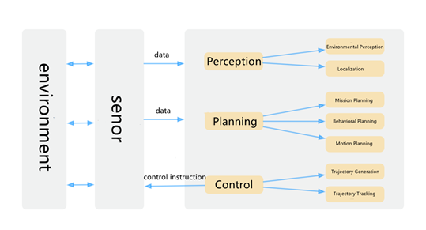
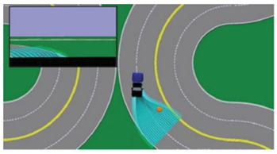
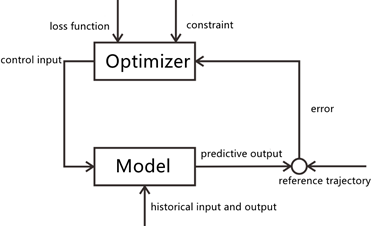

# CHAPTER 1 First Acquaintance with Unmanned Vehicle

With the rapid advancement of driverless technology in the past two years, major vehicle companies and driverless system solution providers, such as Baidu Apollo, Jingchi, etc., have also been making continuous efforts to commercialize driverless technologies. Obviously, unmanned vehicle technology is no longer an out-of-reach "technology of the future". The field of unmanned vehicle technology includes not only vehicle control, path planning, perception fusion and other fields, but also cutting-edge fields such as artificial intelligence, machine learning, deep learning, and reinforcement learning. Unmanned vehicle is bound to set off a new technological and market revolution in the next 5-10 years.

From the perspective of engineering applications, it is very necessary to learn and practice various basic algorithms in unmanned vehicle systems. This chapter is an overview of unmanned vehicle systems, mainly introducing the concept of unmanned vehicles and unmanned vehicle systems, the significance of unmanned vehicle technology, the development history of unmanned vehicle technology, and the architecture of modern unmanned vehicle systems. Through this book, readers will have a clear and complete understanding of currently popular unmanned vehicle systems and algorithm systems.

## 1.1 What is Unmanned Vehicle?

The unmanned vehicle, also called autonomous driving or self-driving vehicle, refers to the its ability to control the motion by itself based on its own perception and understanding of the surrounding environmental conditions and reach the level of a human driver driving vehicle system.

The Unmanned system includes a wide range of technologies and is an interdisciplinary subject, including multi-sensor fusion technology, signal processing technology, communication technology, artificial intelligence technology, computer technology, etc.. Suppose you use one sentence to summarize the technology of unmanned vehicle systems. In that case, it is to identify the surrounding environment and state of the car through a variety of vehicle sensors such as cameras, LIDARs, millimeter wave radars, GPS, inertial sensors, etc.. The obtained environmental information, including road information, traffic information, vehicle location, and obstacle information, etc., can be analyzed and judged autonomously to autonomously control the vehicle's movement and finally achieve unmanned vehicle.

### 1.1.1 Classification standards for unmanned vehicle

In the classification of vehicle intelligence, the industry currently has two sets of standards, one set by the National Highway Traffic Safety Administration (NHSTA) under the U.S. Department of Transportation, and the other set by the International Automobile Established by the Society of Automotive Engineers (SAE). The L0, L1, and L2 classifications of the two are the same. The difference is that the L4 of NHTSA is subdivided into L4 and L5 by SAE. Considering that SAE standards are mostly adopted in China, this book uses SAE standards for the introduction.

| Level | Name                      | Steering, acceleration and deceleration control | Observation of the environment | Response to intense driving | Coping with working conditions |
| ----- | ------------------------- | ----------------------------------------------- | ------------------------------ | --------------------------- | ------------------------------ |
| L0    | Manual driving            | Driver                                          | Driver                         | Driver                      |                                |
| L1    | Assisted driving          | Driver + System                                 | Driver                         | Driver                      | Partly                         |
| L2    | Semi-autonomous driving   | System                                          | Driver                         | Driver                      | Partly                         |
| L3    | Autonomous driving        | System                                          | System                         | Driver                      | Partly                         |
| L4    | Highly autonomous driving | System                                          | System                         | System                      | Partly                         |
| L5    | Fully autonomous driving  | System                                          | System                         | System                      | Fully                          |

Among them, the L0 level means that the vehicle is driven by a human driver.

L1, also known as assisted driving, has added ADAS functions, including lane departure warning (LDW), forward collision warning (FCW), and blind spot detection (BSD) warning lights and so on. It is mainly an early warning reminder, and there is no active intervention function.

L2 is called semi-autonomous driving or partially automatic driving. This type of system already has ADAS functions for intervention assistance, including adaptive cruise control (ACC), automatic emergency braking (AEB), lane keeping assist (LKA), etc.. Vehicles of this level have achieved functions such as autonomous acceleration on highways or autonomous braking in emergency situations. Compared with the L4 level, they can achieve simple automatic control operations.

From L2 to L3, the capabilities of the unmanned vehicle system have undergone a fundamental change. At L2 and below, people still monitor the driving environment and are required to control the vehicle directly. Level 3 is called autonomous driving. The unmanned vehicle system already has comprehensive intervention assistance functions, including automatic acceleration, automatic braking, automatic steering, etc.. For L3, it has been able to perceive the surrounding driving environment according to its own sensor. But, it still requires human drivers to lead the monitoring tasks and even intervene in the autonomous driving system in emergency situations.

L4 is what we call highly autonomous driving, which means that in a limited area or limited environment, such as a fixed park, closed, semi-enclosed highway, etc., the vehicle can fully perceive the environment and autonomously intervene in emergencies. Without any intervention by the human driver. In the L4 level, the vehicle can have no steering wheel, accelerator and brake pedal, but it can only be used in special scenarios and environments. The main difference between L4 and L3 is whether human intervention is still required. L4 unmanned vehicles can solve problems on their own in an emergency. In contrast, L3 unmanned vehicles require the intervention of human drivers in this case.

L5 is fully autonomous driving. L5 does not require a driver, nor does it need anyone to intervene in the steering wheel, accelerator, brakes, etc. It is not limited to driving in specific scenarios and can be adapted to automatic driving in any scene and environment.

### 1.1.2 How difficult is unmanned vehicle?

There is no clear lane on the road in this kind of road condition where passersby, bicycles, tricycles, animals, and even horse-drawn carriages are all participants. This example may seems extreme, but such road conditions are common in developing countries. Although China’s urban public road facilities (road lines, traffic signs, traffic lights) are relatively complete, in areas such as villages and counties, there are many types of traffic participants whose behaviors are unpredictable and the situations are complex. For such complex traffic scenes, any well-trained and sober human driver can easily control these problems and successfully complete the driving task. But for unmanned vehicle systems, it is challenging to deal with such scenarios with the current technology accumulation. These complex and changing traffic conditions are one of the biggest obstacles to achieve the target of fully automatic driving.

The second reason why unmanned vehicle is difficult is caused by human regulations and systems. Road traffic presents various states in different countries and regions. For example, the driving habit in the UK is to drive on the left, while the driving habit in China is to drive on the right. Moreover, different countries have different types and symbols of traffic signal signs, and their meanings are also very different. This also means that there is no universal unmanned vehicle system, and different road laws and customs in different countries are different. The unmanned vehicle system also needs to be "localized". If it is universal, this technology’s cost and system complexity are quite high and unrealistic.

The third obstacle comes from people’s "high expectations" for machines. Humans can tolerate their own mistakes, but their tolerance for machine mistakes is extremely low. In the complex and changeable driving scenarios mentioned in the first point, unmanned vehicles will inevitably make mistakes, such as the sensors not identifying passers-by when the light condition is not good, the high-precision map not containing the road section that has just been completed (but it has been opened to traffic), etc.. The fact is that the current technology and algorithms (whether it is the theory of robotics or the method of artificial intelligence) are still far away and unable to meet the high expectations of the public for unmanned vehicles.

The fourth obstacle comes from the cost of unmanned vehicles. After more than a hundred years of development, the auto industry has reduced the cost of traditional cars to the extreme. People can buy the car they need with only tens of thousands of dollars. However, the unmanned vehicle system introduces a considerable additional cost to the car, including various new sensor equipment, computing equipment, software development costs, etc.. Take the most widely used LIDAR in the perception of unmanned vehicles as an example, the price of LIDAR that meets L4 is generally more than US$100,000. The hardware cost of these sensors alone has far exceeded the price of most vehicles themselves, and how to reduce costs to achieve mass production is currently an important research topic for the commercialization of driverless vehicles.

Of course, there are many obstacles in the way of driverless technology, such as the urgent need to improve driverless regulations, high R&D investment, safety issues, perception of complex scenarios, artificial intelligence technology problems, mass production scale and so on. Autonomous driving technology is still full of challenges at present. In other words, we still have a lot of technical research work to be done in the field of unmanned vehicle. For those who want to work in this field, you can dedicate all you have.

## 1.2 Why do we need unmanned vehicle?

The important reason why unmanned vehicle technology can bring about social reform is that high-level unmanned vehicle can fundamentally make people's travel manners and lifestyles more intelligent. Research shows that unmanned vehicle technology can improve road traffic safety and alleviate urban traffic congestion. The application of unmanned vehicle technology in various fields replaces the birth of a batch of new industrial chains and creates a large number of employment opportunities.

**Improve road traffic safety**

In 2015, about 35,092 people died in car accidents across the United States, while this number is about 260,000 people in China. When estimated by the proportion of the driving population, on average, there will be one fatal accident for every 88 million miles driven. The average probability of fatal car accident caused by a human driver is 0.011% annually and 0.88% in a lifetime. At the same time, about 2.6 million people are injured in road traffic accidents every year with billions of dollars in auto repair costs (limited to deductibles). If we can reduce accidents by 25%, it will save society a lot of expenses.

So, what are the four major causes of road traffic accidents? As follows:

- Drivers being distracted and losing concentration

- Over speed

- Drunk driving

- Reckless driving

However, the problems mentioned above will not exist in unmanned vehicles whose system will not be disturbed no matter people are eating or texting. When passengers are in a hurry, autonomous driving will not exceed the speed limit but deliver passengers to their destinations in a very smooth and reasonable manner in strict accordance with traffic laws. Autonomous driving will not be in a state of drunk driving, and they have no interest in driving recklessly on the highway and driving arrogant cars. Various studies have shown that a high degree of the unmanned vehicle system can greatly improve the safety of road traffic and reduce the occurrence of traffic accidents.

**Alleviate urban traffic congestion**

Traffic congestion is a problem faced by almost all big cities. The widespread use of unmanned vehicles will ease the problem of urban traffic congestion to a large extent, because it can completely overcome human factors and make urban traffic operation the most efficient. Under the big data technology, in the future unmanned vehicle will be able to:

- Quickly understand the congestion situation and adjust the line in time;

- Avoid unreasonable congestion caused by a large number of human factors such as queue jumping;

- Apply the dynamic segmentation of reversible lanes.

Of course, the alleviation of traffic congestion still depends on its specific application in different scenarios.

For example, in the case of traffic jams, the road will become more congested due to queue jumping. Unmanned vehicle will not cause congestion. Instead, they will queue up according to certain rules and order, which can greatly reduce congestion and improve people's travel efficiency. The driverless car can also automatically adjust the route according to real-time road conditions and safely deliver passengers to their destinations in the shortest possible time. Data shows that the average commute time in the United States is 50 minutes. After autonomous driving becomes popular, people will be able to get a lot of extra time to deal with other things instead of being helplessly stuck on the road.

**Improve travel efficiency**

For the operation of manned travel services, we often encounter some bad situations, such as being refused by the driver, unable to call the car, low-quality drivers, etc.. In the operation of unmanned travel services, because there are no drivers, unmanned vehicles will not refuse to carry passengers. As long as there is a dispatch order, they will pick up and drop off as required, and won’t refuse to carry passengers because of the short distance. In addition, it will also reduce the occurrence of accidents when driving at night, such as those caused by fatigue driving, drunk driving, and vehicle robbery. In terms of driverless operation, in addition to supplementing energy, vehicles will be on standby 24 hours a day. No matter the elderly, weak, sick, disabled, or pregnant women, they can enjoy the safety and convenience brought by driverless travel services. What is more, because of no-drivers, travel service will also correspondingly save a large amount of labor costs, which can amortize travel spending. All of the above can greatly improve people's travel efficiency and change people's travel methods and lifestyles.

## 1.3 Basic framework of the unmanned vehicle system

The core of the unmanned vehicle system can be summarized into three parts: Perception, Planning and Control. The interaction of these three parts and the interaction with the vehicle sensor hardware and environment are shown in the following Fig.1.3.1:

It can be seen from the above Fig. 1.3.1 that the driverless software system is actually a hierarchical structure where the perception, planning and control modules play different roles and influence each other. The detailed description of the functions of these three layers are as follows.

Perception refers to the ability of unmanned systems to collect information from the environment and extract relevant knowledge. Among them, environmental perception refers to the semantic classification of the scene understanding ability of the environment, such as the type of obstacles, road signs and markings, pedestrian-vehicle detection, traffic signals, and other data. Localization is the post-processing of the perception results, which helps the unmanned vehicle to understand its position relative to the environment through the positioning function.

Planning refers to the process in which unmanned vehicles make decisions and plans to reach a destination. For unmanned vehicles, this process usually includes reaching the destination from the start, avoiding obstacles, constantly optimizing the driving trajectory and behavior to ensure the safety and comfort of the vehicle. The planning layer is usually subdivided into three layers: Mission Planning, Behavioral Planning, and Motion Planning.

Control refers to the ability of the unmanned vehicle to accurately perform planned actions and routes, and to timely give the vehicle actuator the appropriate throttle, direction, brake signal, etc., to ensure that the unmanned vehicle can drive as expected.

