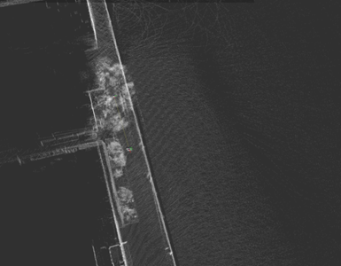
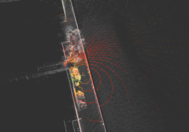
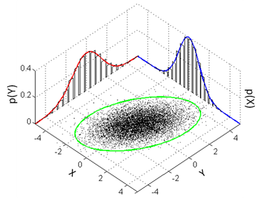
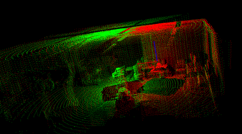
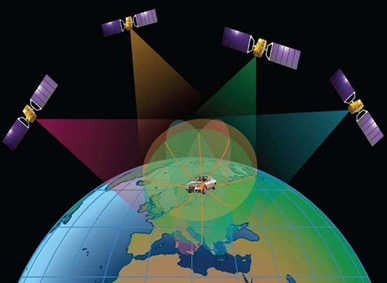
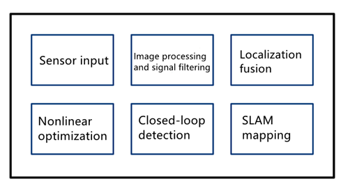

# CHAPTER 2 Localization methods for unmanned systems

Localization is a critical research area in driverless driving. The core of it is to solve the problem of "where am I? and "Where to go?". For human brain, these calculations and cognitive work are done quickly in a flash. Still, the steps need to be translated into machine instructions that the machine can recognize, then completing the location calculation. Similarly, autonomous driving is also the same, and it needs to use the machine's language to let the machine understand the vehicle at this time "where" and "where to go" problems. This is the core problem of autonomous driving localization to solve.

This chapter will briefly introduce and analyze the technologies used for driverless driving and then find the most suitable solution for the actual situation.

## 2.1 The principle of achieving localization

SLAM, also known as CML (Concurrent Mapping and Localization), is a concurrent map building and localization method described as follows. The SLAM approach can be described as a robot that moves from an unknown location in an unfamiliar environment, localizes itself based on the location estimation and map during the movement, then builds incremental maps based on its localization to achieve autonomous localization and navigation of the robot.

Localization based on high-precision point cloud map means the data generated by LiDar transforms into point cloud map by Point Cloud Library (PCL) and completes the localization by matching between point clouds. The high-precision point cloud map is shown in Fig. 2.1.1.

The point cloud data rendering after LiDar scanning is shown in Fig. 2.1.2.

Suppose we want to know the location of the unmanned vehicle, we need to iteratively match the point cloud fragment currently scanned by LiDar with our previously collected global point cloud map. Using Iterative Closest Point (ICP), we can find the closest match for each point of the first point cloud with the second point cloud and then calculate the mean squared error (MSE, a statistical concept) from all the matches, which is the process of finding the minimum mean squared error. The matching process is the process of finding the minimum mean squared error. The variance may come from the measurement error or may be caused by the scene's dynamic changes. By minimizing the error, the unmanned vehicle's position coordinates are calculated to best match the current map environment. The alignment algorithm for reducing the error is also one of the things we will introduce next.

## 2.2 Iterative Closest Point algorithm

The most commonly used iterative algorithm in current 3D alignment is the ICP iterative algorithm, which needs to provide a better initial value. In contrast, the final iterative result may fall into a local optimum rather than a global optimum due to the algorithm's defects.

ICP algorithm principle: giving a reference point set P and a data point set Q (at a provided initial estimate R, T), finding the corresponding nearest point in P for each point in Q to form a matching point pair, using the sum of the Euclidean distances of all matching point pairs as the value of the error objective function error, utilizing SVD (singular value decomposition) decomposition to find R and T in order to minimize the error, rotating Q according to R and T and finding the corresponding point pairs again.

**Disadvantages**: Noise points have to be eliminated (point pairs with too large distances or point couples containing boundary points). Point pair-based alignment does not include local shape information. Searching for the nearest point in each iteration is time-consuming. Computation may fall into local optimum.

**Specific code implementation**: First, let's look at the main application code of the ICP algorithm in the point cloud library.

## 2.3 Normal Distribution Transform

The Normal Distribution Transform (NDT) algorithm is an alignment algorithm based on the standard normal distribution applied to a statistical model of 3D points. It uses traditional optimization techniques to determine the optimal match between two-point clouds. Because it does not use the corresponding points' features to calculate and match during the alignment process, the computation is faster than other methods.

This algorithm, relatively time-consuming and stable, has little relation to the given initial value and corrects well when the initial value error is significant. Calculating the normal distribution is a one-time job performed at initialization without consuming many costs to calculate the nearest neighbor search matching points. The probability density function can be calculated offline at the interval of two image acquisitions. The following parts will describe it in detail.

The principles of how to use the normal distribution (NDT) for alignment were briefly described above. This subsection presents an example of using the Normal Distribution Transformation algorithm to determine the rigid body transformation between two large point clouds (both with more than 100,000 points). The two-point clouds are aligned using the normal distribution transform function provided by the Point Cloud Library (PCL) and the point cloud data are stored in build/cloud1.pcd and build/cloud2.pcd files.

**Step 1**  Read the point cloud information from the PCD file.

**Step 2**  Filter input point cloud

**Step 3**  Initialize transformation parameters and start optimization

**Step 4**  Visualize the aligned point cloud

## 2.4 Localization system based on GPS + INS

Inertial Navigation System (INS) is an autonomous navigation system based on the combination of signals from gyroscopes and accelerometers. It can operate in a variety of environments, such as water, land and air. The basic working principle of inertial guidance, based on Newton's laws of mechanics, measures the acceleration and angular velocity information of the carrier in the inertial reference system, integrates these measurements over time, transforms it into the coordinate navigation system and finally obtains the information of velocity v, yaw angle yaw and position x/y in the coordinate navigation system. It is usually combined with GPS and fused with latitude and longitude information to provide more accurate position information.

It has the following advantages:

1. Since it does not depend on any external information and does not radiate energy to the outside, it is well concealed and not affected by external electromagnetic interference.

2. It can work in the air, on the earth's surface and even underwater all day and all the time.

3. It is capable of providing position, velocity, heading and attitude angle data, and is capable of resulting in good continuity of navigation information and low noise.

4. It has a high data update rate, short-term accuracy and stability.

The disadvantages are.

1. As the navigation information is generate by the integral, the localization error increases with time, the long-term accuracy is poor and problems such as temperature drift and zero drift arise quickly.

2. A long initial alignment time is required before each use.

3. The equipment is expensive.

GNSS (Global Navigation Satellite System), a navigation system based on GPS signals, is essential in unmanned vehicle localization systems. Ordinary GNSS devices can generally achieve localization accuracy within 10m in Standard Localization Service (SPS) localization mode. The localization accuracy may fluctuate within a specific range due to weather, ionosphere, cloud cover and solar activity changes. In the urban environment, especially in densely populated megacities and dense high-rise environments, the localization accuracy can reach 10~100m range. In addition to the above SPS standard localization service, there are other localization services including PPS (Precise Localization Service) for military assistance, SBAS (Satellite-based augmentation systems) that uses satellites as reference stations, GBAS (Ground-Based Augmentation System) that uses ground-based base stations as reference stations, and DGPS (Differential Global Localization System) that uses the differential correction of the reference station to improve the localization accuracy.

At present, many unmanned vehicle companies, including Baidu, Jingchi, Pony, etc., are generally using RTK GPS + INS and other localization methods, RTK (Real-time kinematic, real-time dynamic differential method, carrier phase differential technology). This is a new standard GPS measurement method. The previous static, fast static and dynamic measurements need to be solved afterward to obtain centimeter-level accuracy. Simultaneously, RTK is a measurement method that can get centimeter-level localization accuracy in the field in real-time. It uses the carrier phase dynamic real-time differential method. RTK technology is built based on real-time processing of the carrier phase of two measurement stations. It can provide real-time three-dimensional coordinates of the observation point with centimeter-level accuracy. However, in the urban environment of dense and tall buildings, the localization error can still reach 10~50m. The error mainly comes from the blockage of RTK GPS signal by structures, reflection and diffraction and the denser and taller the buildings are. The worse the localization signal is, the larger the localization error will be.

## 2.5 SLAM-based localization system

Simultaneous Localization And Mapping (SLAM) is a complex system-level concept and does not refer to a specific algorithm. It includes image matching processing module, filtering processing, closed-loop detection, graph optimization theory, matrix operations, etc.. It is a complex system engineering and this book only provides a preliminary introduction to the basic principles and applications of SLAM.

SLAM is mainly used in robotics, where a map is constructed by scanning environmental data points with a LiDar or vision camera and then localizes itself based on map matching. It is common in autonomous driving applications in low-speed scenarios such as unmanned cleaning vehicles, unmanned ferries in low-speed parks and unmanned delivery vehicles. For high-speed autonomous driving, SLAM is not suitable for application in large-area, high-speed autonomous driving scenarios due to its substantial computational overhead, time delay, data storage and other issues based on a grid for calculation, as well as the high-performance requirements of unmanned vehicles for real-time control and safety. High-speed autonomous driving uses HD Map in map positioning. This section and the following are brief descriptions of SLAM's application in the field of robotics and low-speed autonomous driving scenarios.

In the following, we briefly introduce the advantages and disadvantages of each SLAM so that the reader can have a deeper understanding of the current SLAM system.

i.      Advantages and disadvantages of monocular SLAM: The advantage of monocular SLAM is that only one camera is needed. There is no need to consider significant errors in the calibration parameters caused by binocular cameras during long time use or collision situations. The disadvantage is the uncertainty of scale, that is, the inability to measure depth.

ii.      Advantages and disadvantages of binocular SLAM: The advantage of binocular SLAM is that it is easier to obtain scene depth information without considering the problem of monocular scale uncertainty. The disadvantage is that there is a requirement for the device's volume and there must be baseline correction between the two cameras.

iii.      Advantages and disadvantages of RGBD-VSLAM: The edge of RGBD-VSLAM is that the scene depth information can be obtained directly and when working online, the corresponding depth calculation work is reduced, that is, the computational workload is reduced. RGBD depth cameras are also considered to be the most promising vision sensors for future VSLAM. The disadvantage is the slightly high relative cost.

iv.      Advantages and disadvantages of the direct method and feature point method: The advantage of feature point method is that VSLAM based on the feature point method is more robust to fast motion than the direct method. The disadvantage of the feature point method is that real-time performance is worse than the direct method because the corner point detection, description and matching are time-consuming. The advantage of the direct approach is the fast processing speed, simple explanation and matching, because the features are often gradient points and edges and the build map features are denser than the feature point method. The disadvantage of the direct approach is the insufficient robustness for fast motion and it is only suitable for short baseline matching. Because when optimizing iterative poses, the camera motion that is too fast can easily lead to the baselines of adjacent frames that are too long, which leads to too large a pixel deviations of adjacent structures and causes the pose solution to fall into an erroneous local optimum solution.