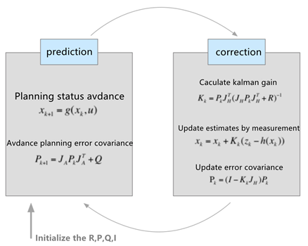

# CHAPTER 3 State estimation and sensor fusion

In autonomous vehicle (robot) systems, Bayesian filters such as Kalman Filter have a wide range of applications, not only limited to state estimation of targets, but also have very wide applications in multi-sensor fusion, localization and SLAM, etc.. It is very important to master and skillfully use Kalman Filter algorithms in the engineering applications of autonomous systems. This chapter, in order to better perform state estimation, we first start with the Kalman filter algorithm, then discuss the extended Kalman Filter for dealing with nonlinear systems and finally discuss the Unscented Kalman Filter.

## 3.1 Kalman Filter and state estimation

### 3.1.1 What is Kalman Filter?

Applying object tracking and prediction is usually necessary to estimate and predict some attractive targets. Why do we make estimates? In the actual scene, we typically need to continuously observe, predict the movement and development of the target to take a more suitable decision for the current state. To estimate a target's, such as the distance, the most direct way is to use the sensor measurement. However, due to the measurement error and noise, the measured value cannot be completely trusted. We can use the method based on the probability and statistics to analyze statistics and estimate the state quantity. Kalman Filter is a state estimation algorithm that combines prediction (prior distribution) and measurement update (likelihood estimation).

Some fundamental probability theory is introduced firstly as a prior knowledge to the Kalman Filter algorithm. Of course, if the reader has a previous knowledge in this area, these essential contents can be skipped.

### 3.1.2 Kalman Filter

The Kalman Filter is a recursive algorithm. Each recursion consists of two main steps. Firstly, a prediction is calculated. Secondly, the predicted and measured values are weighted and summed to obtain the optimal estimate. The determination of the weights are completed by other three steps. So, in a nutshell, the Kalman Filter consists of five steps.

- **Status Forecast**

- **Calculate the forecast error**
- **Measurement error**
- **Calculate Kalman Gain**
- **Calculate the optimal estimate**

- **Calculating the error of the optimal estimate**

### 3.1.3 Kalman Filter in autonomous vehicle sensing module

**Sensors for Autonomous Vehicle Perception Module**

If autonomous vehicles want to drive safely on the road, they need to have "ears to hear and eyes to see". So, what are the ears and eyes of an autonomous vehicle? That are the various sensors installed in the autonomous vehicle. The sensors on an autonomous vehicle can be deployed by the dozens and can be of different types, such as:

- Stereo Camera

- Traffic Sign Camera

- Radio Detection and Ranging (RADAR)

- Light Detection and Ranging (LIDAR)

- Inertial Measurement Unit (IMU)

Stereo cameras are often used to obtain image and distance information. Traffic sign cameras can be used to identify traffic signs based on vision. RADAR, generally installed inside the front and rear bumper of a vehicle, is used to measure moving objects relative to the vehicle coordinate system and can locate and measure distance, speed, etc.. However, it is easily disturbed by strong reflective objects. So it is usually not used for the detection of stationary objects. LIDAR, generally installed on the top of the car, uses infrared laser beam to obtain the distance and position of the object. The advantage of LIDAR is its high spatial resolution and accurate measurement. The shortage is that the equipment is bulky and easy to be affected by heavy rain and foggy weather.

Various sensors have their advantages and disadvantages. In an actual autonomous vehicle, data from multiple sensors are often combined to sense the vehicle's surroundings to provide reliable and stable environmental sensing information. This process of combining the measurement data from various sensors to estimate the state is called Sensor Fusion. The later sections will give a detailed introduction to the application of extended Kalman Filter and Lossless Kalman Filter in sensor fusion. In this section, the Kalman Filter algorithm is mainly considered and estimates pedestrian and vehicle localization based on single sensor data.

**Kalman Filter-based pedestrian localization estimation**

Although simple as it is, Kalman Filter is a very important part of the technological system of autonomous vehicles. Of course, the techniques used in real autonomous vehicle projects are more complex, but the basic principles are still the same as those presented in this book. In driverless vehicles, Kalman Filter is mainly used for state estimation, e.g., for pedestrians, bicycles and other vehicles in the vicinity. In the following, we present the algorithm for pedestrian state estimation as an example.

## 3.2 Advanced motion modeling and extended Kalman Filter

This section focuses on the **Extended Kalman Filter (EKF)** algorithm, which is widely used in nonlinear systems and is usually applied to practical vehicle state estimation (or vehicle tracking). In addition, it is clear that the actual vehicle tracking motion model cannot be modeled using a simple constant velocity model, instead, several additional advanced motion models applied to vehicle tracking are presented in this section. The CTRV (constant turn rate and velocity model) model is used to explain the application of the extended Kalman Filter algorithm. Finally, the code example in the following part will present how to do multi-sensor fusion using EKF.

### 3.2.1 Advanced motion models for vehicle tracking

The first thing to clarify is that whatever the motion model is, it is essentially designed to help simplify the problem, so it is possible to classify the commonly used motion models according to their complexity (number of times).

**Linear motion model:**

- Constant Velocity (CV) model

- Constant Acceleration (CA) model

These linear motion models are based on the premise that the target is assumed to move in a straight line, without considering the turning of the object.

**Non-linear motion model.**

- Constant Turn Rate and Velocity (CTRV) model

- Constant Turn Rate and Acceleration (CTRA) model

CTRV is currently mostly used in airborne tracking systems (aircraft), most of these non-linear motion models assume that the velocity and angular yaw rate  are independent of each other. Therefore, in such motion models, the actual measured angular velocity can change slightly, even if the vehicle is not moving due to the perturbation (instability) of the yaw velocity measurement.

### 3.2.2 Extended Kalman Filter

- **Jacobi Matrix**: The essence of the extended Kalman Filter is to use a linear transformation to approximate a nonlinear transformation. 

- **Process noise**: The process noise simulates the perturbations in the motion model. The original intention for introducing the motion model is to simplify the motion problem to be handled. The simplification is based on several assumptions (in CTRV, these assumptions are constant yaw angular velocity and speed), but in real problems these assumptions are subject to a certain amount of error where the process noise describes how much error the system may face when it runs after a specified period operation due to model simplification. The noise in the CTRV model is introduced mainly from two sources: linear acceleration and yaw angle acceleration. 

- **Measurement**

  

- **Python implementation**: As before, the Python is still used to implement the interactive code, but the actual autonomous car project can also be implemented in C++ as needed. It is very easy and fast to rewrite the following sample code in C++.

## 3.3 Unscented Kalman Filter (UKF)

Previously, we learned about the Kalman Filter and the application of the extended Kalman Filter in target state estimation and implemented a prototype EKF for vehicle position tracking in Python. When the problem becomes complex (nonlinear model), its computational effort becomes very unmanageable. To solve this problem, we will introduce another improvement of the Kalman Filter in this section--Unscented Kalman Filter (UKF).

As known from the previous article, KF is mainly applicable to linear systems and not to nonlinear systems. To deal with nonlinear systems, the extended Kalman Filter that approximates (approximates with linear functions) nonlinear systems by first-order Taylor expansions is introduced above. However, the problem of this method is that for specific problems, it is required to solve the corresponding first-order partial derivatives (Jacobi matrices). As the calculation of Jacobi matrices is too complicated, let's learn another relatively simple state estimation algorithm - UKF.

UKF uses a statistical linearization technique named Non-destructive Transformation. This technique linearizes the nonlinear function of a random variable mainly through a linear regression of *n* points (also called sigma points) collected in the prior distribution. Since the expansion of the random variable is considered, the linearization is more accurate than the Taylor series linearization (the strategy used by EKF).

In other words, when the prediction and update models are highly nonlinear, the EKF predictions will also perform poorly because the variance of the system is still propagated through the linearized nonlinear model. UKF, a technique based on the statistical sampling by selecting a set of sampling points near the place of the mean value, constructs a nonlinear function model by estimating the mean and variance of the distribution formed by these sampling points estimations, in order to construct a nonlinear function model. In other words, previous methods and habits calculate the probability of sampling points based on Gaussian distribution. UKF is the reverse thinking that estimates the mean and variance in line with what kind of Gaussian distribution through a set of sampling points. By adopting this method, you can get more accurate results and avoid the situation that the variance is still propagated through the linear model. But the drawback is the large amount of computation. UKF, like EKF, is also mainly divided into prediction and update processes.

