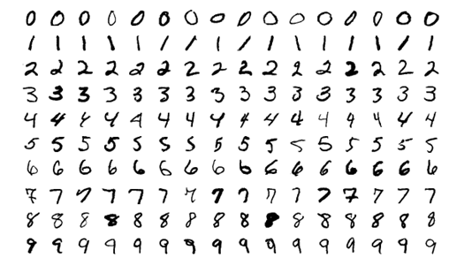
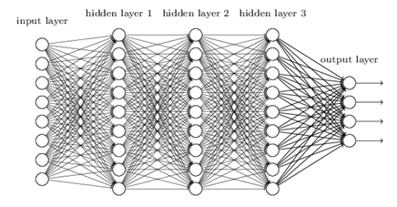
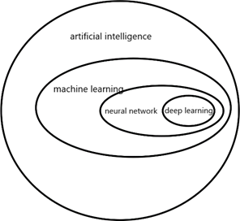
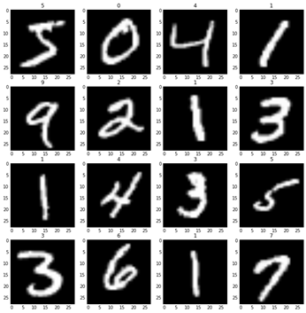
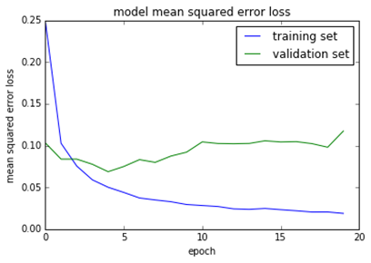

# CHAPTER 4 Fundamentals of machine learning and neural networks

Environment perception is one of the biggest challenges in the current unmanned vehicle system. In the environment perception of the unmanned vehicle, we need to know the obstacles in the vehicle environment, and also need to clarify what the obstacles are. Although both pedestrians and vehicles can be regarded as obstacles, they are not ordinary obstacles. Hence, their behaviors and motion models are also different from ordinary obstacles. In order to make the driving behavior of unmanned vehicles closer to that of human drivers, it is necessary to identify the target obstacles. This process of recognition is a typical process of Pattern Recognition. Although point cloud data based on lidar can achieve target point cloud clustering and there are also some algorithms to support pattern recognition on point cloud [8], the resolution of point cloud data is still too low, no matter for the widely used 64-line lidar or the upcoming 128-line lidar. In some cases, even human beings cannot judge what the object is based on the point cloud of the object. In contrast, the resolution of the image is much higher and the information contained in the image is enough for pattern recognition. Therefore, this book mainly discusses image based pattern recognition algorithms used in environment perception of the unmanned vehicle .

So what exactly is pattern recognition? Pattern recognition is the process of identifying pattern types through computer models. The "pattern" refers to the environment and the object we study. For human beings, the recognition of optical information (obtained by the visual organs) and acoustic information (obtained by the auditory organs) is particularly important, which are two important aspects of pattern recognition. The representative products visible on the market are optical character recognition (OCR) and speech recognition system. In the field of unmanned vehicle perception, especially in the field of visual perception, detection and recognition of images and lidar point clouds are the main methods.

Traditional computer vision often needs to artificially design features, which are different for different tasks. For example, lane detection and pedestrian detection need to design features respectively. On the other hand, features designed artificially often have omissions. For unmanned vehicles with extremely high safety requirements, software program design that ignores some details is bound to have defects, which may lead to serious safety consequences.

This section will first introduce some basic concepts of machine learning, and the following sections will further elaborate on deep learning, including the application of machine learning and deep learning in the field of unmanned vehicle.

## 4.1 Basic concepts of machine learning

Machine learning is extremely important in unmanned vehicle system, among which deep learning has become a hot research topic in recent years. Mastering the basic theory of machine learning, such as reinforcement learning control, environment perception based on deep learning, etc., is the first step in the research of end-to-end unmanned vehicle. This section focuses on explaining the basic concepts of machine learning and describing the process of machine learning tasks for the reader.

​    We take Modified National Institute of Standards and Technology (MNIST)[1] handwritten digit recognition as an example to introduce the basic concepts of machine learning. The handwritten digits are like the Fig. 4.1.1below:

Machine learning is a kind of algorithm to enhance automatically the performance based on the data or previous experience[2]. Here is the definition of machine learning, which might seem hard to understand. Let's break it down:

- First of all, for the task of handwritten numerals recognition, the data or past experience is the collected handwritten numerals. We want the program to learn a kind of ability or intelligence from these data. This ability is that by learning, the program can recognize handwritten numerals as human.

- Performance criteria are metrics that measure the ability of our programs. In recognition tasks, this indicator is the accuracy of recognition. Given 100 handwritten digits, 99 of them are correctly recognized by our "smart program ", and then the accuracy is 99%.

- Optimization is about making our "smart programs" smarter even than humans, based on past experience or data.

Machine learning algorithms are able to learn and improve from experiences. In many cases, we describe these experiences as data. Therefore, experience is data, and these collected data are called dataset. The previously mentioned handwritten digit is called the MINIST Dataset, and each data is called a sample. The process of learning on these existing datasets is called training. Therefore, this dataset is also called the training dataset. Obviously, we not only care about the performance of machine learning algorithm on the Training Set, but also hope that the algorithm can correctly recognize the handwritten numbers that it has never seen before. The performance on the new samples (dataset) is called Generalization Ability. For a task, the stronger the Generalization Ability, the more successful this machine learning algorithm is.

According to the usage of datasets, machine learning can be divided into the following three categories:

- Supervised Learning: The dataset contains both samples (handwritten digit images) and corresponding labels (each number corresponds to each type handwritten picture).

- Unsupervised Learning: The dataset contains only samples, and does not contain labels corresponding to samples. The machine learning algorithm needs to determine the category of samples by itself.

- Reinforcement Learning: It is a kind of semi-supervised learning that emphasizes how to act based on the environment to maximize the expected benefits, and we will focus on it in the following chapters.

Currently, neural networks and deep learning are mostly supervised learning. With the advent of the era of big data and the improvement of computing power brought by GPU, supervised learning has made breakthrough progress in a large number of fields such as image recognition, target detection and tracking, machine translation, speech recognition and natural language processing (NLP). However, there is no breakthrough in the field of unsupervised learning at present. Since the main machine learning technology applied in the field of unmanned driving is still supervised learning, we will focus on related content of supervised learning. Of course, this book will also introduce the research of reinforcement learning in the field of unmanned driving.

> Note that in this section, in order to facilitate the reader's understanding, we use handwritten digit recognition to describe the processing tasks. In fact, there are many other tasks that machine learning algorithms can handle, such as classification, regression, machine translation, anomaly detection, synthesis and sampling, missing value filling, and so on. These tasks are difficult to be solved by a deterministic program designed artificially, while they can learn patterns from a large amount of data, and use the learned patterns to predict on new dataset.

## 4.2 Supervised Learning

Supervised learning is a kind of method in machine learning, which is the most widely used machine learning method at present. In this section, we have a detailed introduction of the working mode and process of supervised learning from the perspectives of empirical risk minimization strategy (ERM), model and optimization algorithm.

### 4.2.1 Empirical risk minimization

When the training dataset is large enough, the empirical risk minimization principle can ensure a good learning effect, which is an important reason for the success of the deep neural network. Professionally, we call the size of the existing dataset Sample Size. No matter what application field, a good big dataset means that the machine learning task has been half successful.

### 4.2.2 Overfitting and underfitting

Through the concept of machine learning, we know that the key to measure a machine learning model is its generalization ability. An important metric to measure the generalization ability is the training error and test error of the model.

l Training error: the prediction error of the model in the training dataset

l Test error: the prediction error of the model on test dataset it has never seen

These two errors correspond to two problems that need to be solved in machine learning tasks: Underfitting and Overfitting. When the training error is too high, the function learned by the model does not satisfy the empirical risk minimization. Specifically, if the recognition accuracy of the model in the training set is also very poor, we call it Underfitting. When the training error is low but the test error is high, that is, the gap between the training error and the test error is too large, we call it Overfitting. At this time, the model has learned some redundant rules on the training set, which is shown as high prediction accuracy on the training data set and low prediction accuracy on the test data set, which can not be used for training the model parameters.

Model capacity determines whether the model tends to be overfitting or underfitting. Model capacity refers to the ability of the model to fit various functions. In general, the more complex the model is, the more complex the function (or the rule, or the pattern) can be expressed. So for a specific task (such as handwriting recognition), how to choose an appropriate model capacity to fit the corresponding function? According to the Occam's Razor Principle, we should choose the simplest hypothesis that can explain the observed phenomenon.

This can be understood as a minimalist design principle. When dealing with a task, you should use the simplest possible model structure. How to choose the model structure? Specific problems require specific analysis, which we will discuss later.

In this section, we take a quick look at the important components and structures of machine learning tasks.

First of all, machine learning is used to accomplish specific tasks: handwriting recognition, pedestrian detection, housing price prediction, etc.. This task must have certain performance measures, such as detection accuracy, prediction error, etc..

Then, in order to handle this task, we need to design models that can learn data patterns from the data based on certain strategies (such as empirical risk minimization) and certain algorithms (such as gradient descent algorithm).

Finally, the model must be able to handle the cases that do not appear in the training set, so that the machine learning task is successful.

The following articles will introduce the specific tasks, models and algorithms. In general, machine learning, especially deep learning, plays a very important role in the study of unmanned vehicles. We will gradually learn the machine learning algorithms in unmanned vehicles.

## 4.3 Fundamentals of Neural Network

In the previous section, we covered the basics of machine learning, especially the basic components of supervised learning: data, model, strategy and algorithm. In this section, we will specifically study a supervised learning algorithm called neural network. Deep learning models are mostly deep artificial neural network. Therefore, before further exploring the application of deep learning in unmanned vehicle, we first have a look at the theoretical basis and code implementation of neural network.

Now that we are talking about neural network and deep learning, let's take a look at the relationships and categories of various concepts, as shown in the Fig. 4.3.1 below.

The concept of artificial intelligence (AI) is very broad, where machine learning is a kind of method based on statistical learning in artificial intelligence and neural network is one of the supervised learning algorithms in machine learning, while deep learning is a representation learning algorithm built by increasing the number of layers of neural network and trained by a large amount of data.

We introduced several factors of supervised learning (model, strategy and algorithm) in the previous section, based on them we will introduce these factors in the neural network algorithm one by one. We still use the hand-written digit recognition task introduced in the last section as an example, and the experimental dataset is MNIST dataset.

## 4.4 Use Keras to implement the neural network

Next, we use the Keras library to implement a three-layer neural network model quickly. We use cross entropy as the loss function and SGD as the optimization algorithm to train the model. After training, we saved the model as a "model.json" file and then used our own handwriting to verify the accuracy of the model. We completed the training, adjustment and verification of the model in the Jupyter Notebook.

**Step 1** Data preparation

**Step 2** A small change in three-layer network -- deep feedforward neural network

This chapter introduces the basic principles of the neural network, and implements the MNIST handwriting digit recognition neural network code based on the Keras deep learning API. Next, we will learn the application of deep learning in the unmanned sensing module, and the end-to-end unmanned vehicle technology based on deep learning. We will further explore the theory and technology of the combination of deep neural network and reinforcement learning, and apply them to unmanned vehicles.