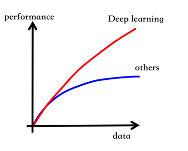
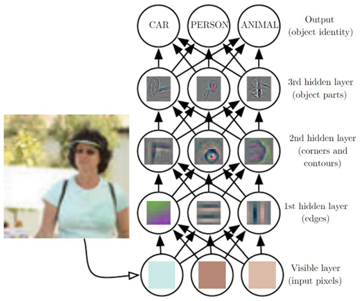
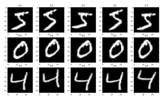
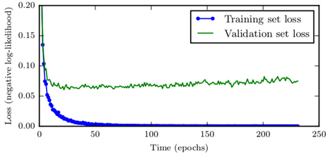
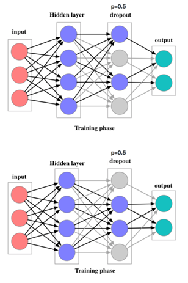
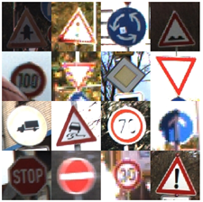
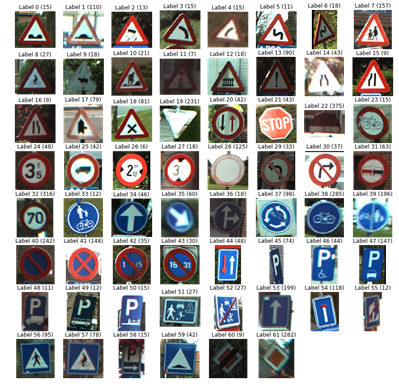

# CHAPTER 5 Deep learning and Visual perception

In the field of autonomous driving, a lot of achievements have been made in the field of pattern recognition relying on machine learning and deep learning. In recent years, a series of progress has been made in the autonomous driving perception method based on deep learning. This chapter will introduce the application of deep learning in unmanned driving from the perspective of deep feedforward neural network in as straightforward a way as possible.

## 5.1 Deep Feedforward Neural Network — Why is it necessary to be deep?

At the end of the last section of Chapter 3, we have actually been exposed to deep feedforward neural networks: a four-layer neural network to solve the MNIST handwriting recognition problem is adopted to achieve the recognition rate of 98%. In simple terms, the depth of the feedforward network is the earlier version "deepening" three layers BP network.

According to the introduction of the previous neural network, only three hidden layers of the neural network can fit any function. So why do we deepen the number of layers in the network? This question should be viewed from two aspects: one is the efficiency of model training under big data, and the other is representation learning.

### 5.1.1 Model training efficiency under big data

The breakthrough of deep learning gives credit to the following three elements:

- Neural network theory (the theoretical basis for a long time)

- Big data (thanks to the development of the Internet)

- Stronger parallel computing capabilities (represented by GPU)

Big data is an important factor in the success of deep neural networks in performance. Traditional machine learning algorithms generally fall into a performance bottleneck, after the amount of data increases to a certain order of magnitude. This is especially so for the support vector machine that based on structural risk minimization. The performance of the support vector machine will be saturated after the amount of data achieve a certain level. But the neural network seems to be a machine learning algorithm that can be continuously expanded. When the amount of data increases, more powerful neural networks can be trained by increasing the number of neurons and the number of hidden layers. 

### 5.1.3 Representation Learning

Another explanation for deep learning is deep representation learning (also known as feature learning). The following figure is a visualization result of the activation of hidden layer neurons in a multi-layer convolutional network after inputting an image.

As shown in the figure, the first several layers of the neural network actually play the role of feature extraction and representation establishment. This is different from the artificial design features of traditional machine learning methods. The feature design of the neural network is carried out with the training of the neural network, which is a process of automatic representation establishment. From the Fig. 6.1.2, we can also find that the closer the layers are to the input, the simpler features the layers extract, while the further the layers are from the input, the more complex features the layers extract. For example, the first layer extracts "edge" features, the second layer extracts contour features and the third layer combines simple underlying features to synthesize more advanced representations as local features of the recognition object. By abstracting the features layer by layer, the more layers of the neural network, the richer feature representations it can acquire.

## 5.2 Regularization technology applied to deep neural networks

When the number of hidden layers and the number of neurons in the neural network increases, the number of parameters increases substantially, which leads to the excessively large model capacity of the neural network. The model capacity of neural networks, especially deep neural networks, is almost always too large. Excessive model capacity has advantages and disadvantages. On one hand, larger model capacity means stronger representation ability which can learn more complex mapping relationships. On the other hand, oversized model capacity will make the training of the model "uncontrollable", that is, the network may be more prone to overfitting during training so that the model performs well on the training set. But its generalization ability is poor. In machine learning, some strategies are proposed to reduce the gap between test error and training error, namely improving the generalization ability of the model, enhancing the robustness of the model, etc.. These strategies are collectively referred to as Regularization. The four common regularization techniques below will be introduced in the following parts of the chapter:

- Data Augmentation

  

- Early Stopping

  

- Parameter Norm Penalties

- Dropout

  

## 5.3 Actual combat — traffic sign recognition

In this section, the traffic sign recognition tasks will be accomplished by using the knowledge of deep learning. Traffic signs, also called road signs and road traffic signs, are road facilities that use words or symbols to convey guidance, restrictions, warnings and instructions. Providing unmanned vehicles with the ability to recognize traffic signs is an important prerequisite for ensuring that unmanned vehicles drive in accordance with actual traffic rules. At present, in the actual research and development of unmanned driving systems, the solution ideas for understanding traffic signs are divided into the following two types:

- Directly write the information of the traffic signs to the high-precision map: This solution writes the traffic sign information of the road section into the semantic map when the high-precision map is drawn so that the vehicle only needs to have accurate positioning to determine the traffic rules of the road section (speed limit, warning signs, etc.).

  

- Recognize the traffic signs in the images captured by the camera: This solution uses computer vision technology (including traditional vision methods, deep learning methods, etc.) to understand whether the unmanned vehicle camera sensor image contains traffic signs and what traffic signs are included. 

