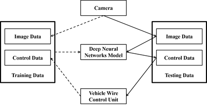
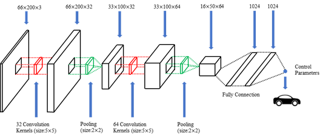

# CHAPTER 6 Transfer Learning and the End-to-End Self-Driving

In the first two chapters, we introduced the basic knowledge of Neural Network and Deep Learning. In this chapter, we will introduce the concept of Transfer Learning and apply it to the End-to-End Self-Driving Model. Generally, the training of large-scale Deep Neural Network requires a large amount of computing resources. However, many ordinary developers only possess a crude Deep Learning computing environment, which has become one of the bottlenecks hindering the wide application of Deep Learning. For example, in order to train a 50 layers Residual Neural Network, it takes about 14 days to complete the model training using a NVIDIA M40 GPU. If you replace it with an ordinary PC (Personal Computer), it may take decades to complete the training. For such problems, Transfer Learning is a better strategy.

End-to-End Self-Driving is a basic technology in self-driving. In the process of implementation, only the camera loaded on the driverless vehicle is used to obtain the image data of road conditions to train the deep neural network model. Then, the real-time image data collected by the camera is input into the trained deep neural network model, and the control parameters are output to determine the driving strategy of the driverless vehicle. In essence, the End-to-End Self-Driving is a simplified autonomous vehicle model, and the actual road condition processing may be very complex, but it can intuitively help us understand the application of Deep Learning in self-driving.

## 6.1 Transfer Learning

Deep Learning is more and more widely used in the industry. However, it is time-consuming and laborious to build and train the deep learning model from the very beginning. Engineers need to redesign the network architecture and conduct a lot of training and testing experiments to get the appropriate model. A good strategy is to adopt a certain existing deep learning model and fine-tuning on the basis of the original model to adapt to the new application scenario, which is called as Transfer Learning[1].

Therefore, it is not necessary to train the model from the beginning when developing deep learning applications. At present, in many common application scenarios, relevant research teams have trained high-precision deep learning models. ImageNet[2] is a large-scale data set with 16 million images, which has been marked by a large number of volunteers on the Internet. The data set covers many important image application scenarios, so it is a very valuable public data set. Aiming at solving the problems of recognition and classification on the ImageNet dataset, the most famous work is developing the ImageNet Large Scale Visual Recognition Challenge (ILSVRC). Although the ImageNet challenge ended in 2017, many excellent recognition models for ImageNet have emerged, such as AlexNet, VGGNet, Google Inception Net, ResNet and so on. Transfer Learning can easily transplant these classical models to new application scenarios, which mainly depends on two factors: the amount of data in the new application and the similarity between the new application and the original model. Generally, Transfer Learning is mainly applicable to the four application scenarios, as shown in Table 6.1:

| Dataset  size | Application  similarity | Model  training method                                       |
| ------------- | ----------------------- | ------------------------------------------------------------ |
| More          | Higher                  | Fine  tuning                                                 |
| More          | Lower                   | Fine  tuning Or Retraining                                   |
| Less          | Higher                  | Modifying  and Training the Full Connected Classification Layer |
| Less          | Lower                   | Redesigning  and Training a New Model                        |

## 6.2 The End-to-End Self-Driving

Deep Learning plays an important role in the field of unmanned driving, in which the end-to-end self-driving technology based on Deep Neural Network is a very important part. In practice, the simulator is usually used to simulate the effect of the End-to-End Self-Driving. The basic consideration of the End-to-End Self-Driving is very simple: Firstly,operating the vehicle or simulator manually to collect the control data. In this process, we need to record the real-time road scene look forward images in the vehicle collected by cameras. In practice, in order to improve the generalization ability of the model, multiple cameras (such as three cameras) can be used to collect road images from different perspectives at the same time. At the same time, it is necessary to record the control parameters generated by the human to drive the vehicle correctly, such as the steering wheel angle, brake and throttle. When training the deep neural network model, the collected road images are used as the input parameters of the model, while the vehicle control parameters are used as the output data of the model. After training the neural network model based on these road images and control parameters, it has a certain ability to predict the real-time road scene collected by cameras and further can output the control parameters of the vehicle. These parameters are input to the vehicle by a control unit (or as the input parameters of the simulator) to achieve the purpose of controlling the automatic driving of the vehicle.

As shown in the figure above, the core of the End-to-End Self-Driving is the deep learning model. During the driving process, the real-time image data of different road conditions is collected and the human control parameters of the car under different road conditions are also recorded. These data are set into the deep learning model as training data. When the deep learning model is used to control the self-driving, the real-time road images are collected by the camera which are the input into the deep learning model to get the vehicle wire control parameters for the autonomous driving control. Therefore, the End-to-End Self-Driving is actually a very simple unmanned driving model, which not only uses the data collected by the camera and ignores other sensors, but also only makes operational decisions based on the camera data. This is certainly not appropriate in actual unmanned driving, but as research, we can test the control ability of the deep learning model for the unmanned vehicle.

## 6.3 The End-to-End Self-Driving Simulation

When simulating the End-to-End Self-Driving, several components are required, including simulators, image processing, deep learning frameworks and so on.

- **The selection of simulator**: In order to simulate the control of the unmanned vehicle by the deep learning model, it can be achieved by the unmanned vehicle simulator on the PC. Udacity is an online education institution suitable, it also provides an unmanned vehicle simulator. The details of the simulator can be found on GitHub. There are also many open-source unmanned vehicle simulators on GitHub for the research. We can flexibly choose these simulators when experimenting, but it is important that the simulator can collect road condition image data and control data in real-time. Before training the autonomous driving model, it is necessary to collect training data, whose image data is input to the model and control data is output to the model. In order to simplify the problem, the operating speed of the simulator can be set to a fixed value. In this case, we only need the steering wheel to control the car simulator for unmanned driving. On the whole, the most common way to build this kind of deep learning model is the convolutional neural network model. The input is image data and the output is a single control parameter.

- **Data Collection and Processing**

- **The Construction of Deep Neural Network Model**

  

  This chapter mainly introduces the content of Transfer Learning and End-to-End Self-Driving. In order to develop new deep learning applications efficiently, transfer learning strategies are often applied to engineering practices. Although many deep learning application scenarios have great differences, in most cases, we can just fine-tune or retrain the model to meet the application requirements of new scenarios. In the worst case, we can still refer to some classic deep learning models to design our own deep learning application models.

  End-to-End Self-Driving is a very intuitive model of unmanned driving. It ignores the various sensor data of unmanned vehicles and simulates unmanned driving only through the road condition data collected by the camera. It also simplifies the entire unmanned driving, which can be used as the basis for unmanned driving research. When discussing the end-to-end self-driving model, we mainly mentioned three deep learning models: shallow neural network model, LeNet-like convolutional neural network model and NVIDIA end-to-end self-driving model. But it needs to be clear that in a real unmanned driving environment, it is obviously unsafe to rely solely on the road condition images collected by the camera to make driving decisions. Therefore, we also need to comprehensively consider the data collected by multiple sensors to make joint decisions.