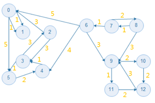
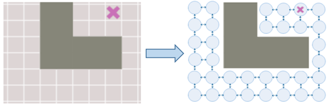
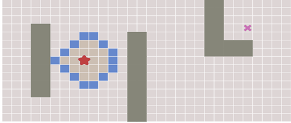

# CHAPTER 7 Getting Started With Autonomous Driving Planning

This chapter will focus on the planning layer of autonomous vehicle systems which consists of three layers: Task planning, Behavior planning and Motion planning. Task planning is also called as path planning, in task planning, A* algorithm as a discrete space search algorithm is primarily used to solve the problem of optimal path search in discrete space. Behavior planning is a core part of behavior planning for autonomous vehicle systems. The Finite-State Machine (FSM) and Hierarchical Finite-State Machine are often used to design a behavioral decision model. In order to make the motion planning easier to understand, a series methods of spline interpolation will be illustrated.

**Representation of a directed graph**

**A grid is a directed graph**

**Breadth-First Algorithm (BFS)**

**[TO DO: The detail of the methods]**