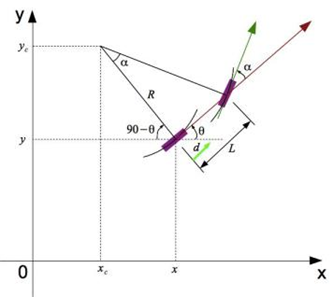
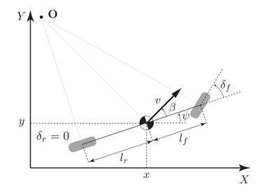
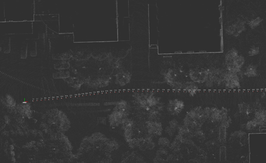
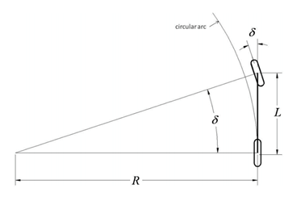

# CHAPTER 8 Vehicle Model and Advanced Control

Control module as an actual processing module in the unmanned vehicle, aims to making the vehicle’s movement as far as possible according to the trajectory computed by the planning module. This chapter will introduce the control theory and technology required in the field of autonomous driving, including some simple vehicle models, PID control and predictive control model.

## 8.1 Kinematic Bicycle Model and Dynamic Bicycle Model

Before understanding advanced control algorithms for vehicles, it is very necessary to knowledge the vehicle model, which is a kind of model that can describe the vehicle motion. Obviously, the more complex the model, the closer to the actual vehicle motion in reality. This section introduces two widely used vehicle Models：Kinematic Bicycle Model and Dynamic Bicycle Model.

Based the top-to-bottom approach, the autonomous driving system usually is divided into three layers: perception, planning and control. The planning layer specifies the driving path based on higher-level layer information and real-time feedback information from lower layer, then the output is the reference action sequence of the vehicle. What the control system need to be carried out is to drive the vehicle strictly in accordance with this reference action sequence. Generally speaking, it is described in the form of a polynomial.

**Bicycle Model**

Model is usually aimed to build to simplify the complex problem. To simplify the motion of a car, the bicycle model is a simple and effective way. Some assumptions based on the bicycle model are described:

- Ignore the movement of the vehicle at the z-axis direction, that is, assuming that the vehicle is a moving object on a two-dimensional plane (it can be equivalent to the overhead view in the sky).

- The structure of vehicle is like a bicycle so that the front two wheels of the vehicle have the same angle and speed and the rear two wheels are also the same, then the front and rear tires can be described by one tire likely a bicycle.

- the movement manner of the vehicle is also the same as that of a bicycle that means the front tires control the turning angle of the vehicle.

## 8.2 Model Predictive Control based on Kinematics Model

In the previous section, two common vehicle models-kinematic bicycle model and dynamic bicycle model are introduced. Because the traditional PID controller, however widely used since its simple and easy to implement, is not suitable in the lateral vehicle control (steering control) due to the real-time delay, this section introduces a new control theory called Model Predictive Control (MPC) based on kinematic vehicle model. Specially, in lateral control, the optimal control method is MPC, a theory that pursues optimal control in a short time interval, which take the control delay into the vehicle model to avoid the delay drawback of the PID controller.

## 8.3 Trajectory Tracking

For autonomous driving system, the trajectory computed by the planning module usually consists of series of waypoints called global waypoints, containing spatial position information, attitude information, velocity and acceleration, etc. The difference between global waypoints and trajectory is that the trajectory is also a kind of path point containing time information through adding time constraints to the path point. These trajectory points containing time information are usually called local waypoints. The following Fig. 8.3.1 shows the sequence of global path points in the map:

The current popular methods to tracking the trajectory for the unmanned vehicle are divided into two categories: methods based on geometric tracking and methods based on model prediction. In this section, a simple and widely used method based on geometric tracking named Pure Pursuit is introduced.

Before discussing the Pure Pursuit tracking algorithm, review the geometric bicycle model in the Fig. 8.3.2:

